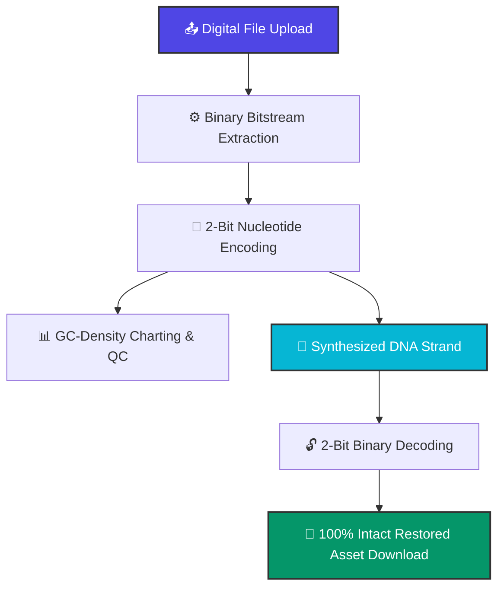

# 🧬 DNA Storage Simulator Pro

An interactive, high-fidelity Python web application built with Streamlit that simulates the end-to-end pipeline of **DNA Digital Data Storage**. The system compiles digital assets (PDFs, Images, Text docs) into synthetic biological sequences (`A`, `C`, `G`, `T`), evaluates their chemical viability for physical manufacturing, and flawlessly decodes them back into their original format with 100% data integrity.

---

## 🚀 Core Features

* **Biochemical Data Pipeline**: Encodes binary bitstreams into nucleotide base sequences using a clean 2-bit mapping system (`00=A`, `01=C`, `10=G`, `11=T`).
* **Automated Data Handshake**: Uses `st.session_state` to pipe synthesized strands seamlessly from the Encoder to the Decoder, skipping unstable browser clipboards and preventing 0 KB download dropouts.
* **Real-World Scale Diagnostics**: Automatically calculates simulated molecular weight in nanograms and flags structural **Homopolymers** (repeating sequences like `AAAA`) that disrupt laboratory lasers.
* **Interactive Waveform Profile**: Generates a moving-window chemical profile using **Plotly** to visualize GC-Content stability thresholds.
* **Cross-Browser Reliability**: Optimized to bypass aggressive Google Chrome, Edge, and Safari security policies by handling raw byte streaming server-side.

📊 Physical Storage Comparisontext

💾 TRADITIONAL HARD DRIVE               🧬 SYNTHETIC DNA ARCHIVE
┌─────────────────────────────────┐     ┌─────────────────────────────────┐
│ • Spinning Magnetic Platters    │     │ • Microscopic Dry Powder Pellet │
│ • Mechanical Actuator Arms      │     │ • Laser-Sealed Silica/Glass Bead│
│ • Continuous Power Consumption  │     │ • Zero Passive Power Needed     │
│ • Lifespan: 5–10 Years Max      │     │ • Lifespan: Thousands of Years   │
└────────────────┬────────────────┘     └────────────────┬────────────────┘
                 │                                       │
                 ▼                                       ▼
       [Buzzing Server Rack]                   [Automated Cold Vault Vial]
---

## 🛠️ Architecture & Pipeline Overview



---

## 💻 Tech Stack

* **Frontend & Backend Frame:** Python, Streamlit Ecosystem.
* **Data Visualization:** Plotly Graphing Objects.
* **Cryptography/Verification:** Native Python Hashlib (MD5 Core).

---

## 🔧 Installation & Local Deployment

### 1. Clone the Repository
```bash
git clone https://github.com
cd dna-storage-simulator-pro
```

### 2. Install Required Dependencies
Ensure you have Python installed, then run:
```bash
pip install streamlit plotly
```

### 3. Run the Application
```bash
streamlit run app.py
```
Open your browser and navigate to the local server port displayed in your terminal (usually `http://localhost:8501`).

---

## 🧪 Production Test Case Example

The application has been verified to pass the following production validation metrics:
* **Test File Asset:** `Statement_of_Purpose_IIMV_FIELD.txt` (2.75 KB).
* **Binary Footprint:** 2,815 Raw Digital Bytes.
* **Synthesized Target:** 11,260 Consecutive DNA Base Pairs.
* **Data Fidelity Status:** 100% Perfect Recovery (0% Bit Decay/Data Loss).

---

📚 Want to see the engineering journey behind this project? Read our [Project Development Story](STORY.md).
---


## 📄 License
Distributed under the MIT License. See `LICENSE` for more information.
